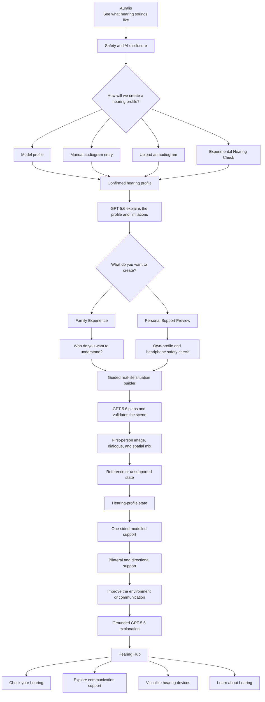
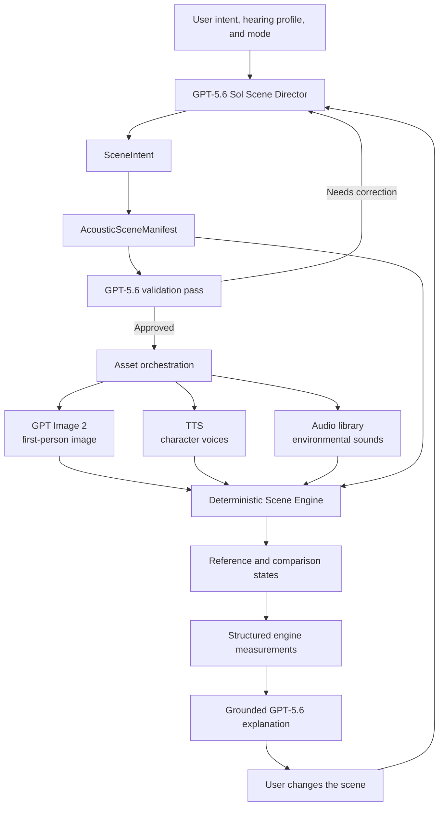

# Auralis — Pre-Build Week Preparation Final

> **See what hearing sounds like.**

## Frozen Product and OpenAI Build Week Preparation Brief

- **Original document date:** 11 July 2026
- **Frozen on:** 12 July 2026
- **Status:** Frozen pre-rules preparation document
- **Competition implementation status:** Not started
- **Revision policy:** Do not edit until the final official competition rules have been reviewed
- **Primary platform:** Responsive web application / PWA
- **Build environment:** Codex with GPT-5.6 Sol
- **Runtime intelligence:** GPT-5.6 Sol as the central scene director and orchestrator
- **Primary experience:** Family Experience
- **Secondary experience:** Personal Support Preview
- **Product boundary:** Educational and illustrative; not diagnostic, prescriptive, or a replacement for professional hearing care

> This file is the final record of Auralis product preparation completed before publication and review of the final competition rules. Any later rules-driven decisions, scope changes, implementation work, generated production assets, testing, or submission preparation must be recorded separately.

---

## 1. Executive Summary

Auralis is a generative hearing-experience platform that turns a hearing profile and a real-life context into a coherent first-person scene. It helps people hear an illustrative representation of the difficulties experienced by someone close to them, compare modelled forms of hearing support, and discover how changes in the environment or communication can improve the situation.

The primary Build Week story is not a generic hearing-loss simulator and not a medical application. It is a shared-understanding tool:

> **Auralis turns a hearing profile into a shared first-person experience — helping people hear the problem, explore support, and discover what they can change.**

The experience is generated and directed by GPT-5.6 Sol. Sol understands the people involved, their relationship, the purpose of the experience, the hearing profile, and the relevant life situation. It creates a structured acoustic scene, validates it, instructs image and speech models, passes deterministic instructions to the audio engine, interprets verified engine outputs, and safely modifies the scene when the user changes the environment.

The main competition proof is one perfectly executed transformation:

1. A family member creates a scene representing a difficult real-life situation.
2. The scene is heard as a reference.
3. The same scene is heard with an illustrative hearing profile applied.
4. Modelled support configurations are compared without changing the underlying scene.
5. The environment or communication is improved.
6. GPT-5.6 explains only the differences supported by the deterministic engine.

The wider platform is visible through additional branches, but the competition demo remains focused on this single journey.

---

## 2. Product Identity

### Name

**Auralis**

### Tagline

**See what hearing sounds like.**

### Product category

Auralis is best described as a:

- generative hearing perspective lab,
- shared family understanding experience,
- educational acoustic simulation platform,
- contextual hearing-support exploration tool.

It must not be described as:

- a clinical audiometer,
- a diagnostic hearing test,
- a hearing-aid fitting system,
- a virtual hearing aid,
- a predictor of benefit from a real hearing device,
- a substitute for an audiologist, physician, or hearing-care professional.

### Core promise

Hearing loss is difficult to explain through an audiogram alone. Auralis translates an abstract hearing profile into a concrete, personal moment that another person can see, hear, compare, and improve.

### Emotional product insight

The intended moment is:

> “Now I understand why my father loses track of the conversation at our family table — and why simply speaking louder is not always enough.”

---

## 3. The Problem

An audiogram communicates thresholds, not lived experience. Family members, partners, colleagues, and sometimes the person with hearing loss may understand that a hearing problem exists without understanding what it means in a specific acoustic and social situation.

Common misunderstandings include:

- assuming that all speech is simply quieter,
- assuming that louder speech automatically becomes clearer,
- underestimating the effect of distance and reverberation,
- overlooking speech arriving from an unsupported side,
- overlooking the effect of overlapping talkers,
- expecting a single device or a basic processing configuration to solve every situation,
- focusing only on a device while ignoring environmental and communication changes.

Existing explanations are often static, generic, technical, or disconnected from the user's real life. Auralis creates a scene that is personally relevant and keeps the visual scene, dialogue, speaker positions, background sounds, hearing profile, support states, and explanations mutually consistent.

---

## 4. Target Audiences

### Primary audience

Family members, partners, and close friends who want to understand the hearing difficulties of someone close to them.

### Secondary audiences

- adults with a known hearing profile who want to explore a limited personalised support preview,
- hearing-care professionals demonstrating general principles,
- students learning about hearing and communication,
- colleagues or carers seeking to understand a person's communication difficulties,
- people exploring hearing through non-personal model profiles.

### Primary Build Week persona

> A son wants to understand why his seventy-year-old father struggles during a family dinner with several speakers and a television playing in the background.

This persona should drive the default demo scene and the first-run experience.

---

## 5. Locked Product Principles

1. **One excellent journey proves the platform.**  
   The competition experience is built around Family Experience, not around displaying every planned feature.

2. **The purpose is selected before the scene is generated.**  
   Family Experience and Personal Support Preview require different questions, safety rules, audio processing, and explanations.

3. **GPT-5.6 Sol is the central director.**  
   It is not merely a copywriter or explainer. It owns intent interpretation, scene planning, validation, orchestration, adaptation, and grounded explanation.

4. **The audio engine is deterministic.**  
   GPT-5.6 never invents signal-processing results. It instructs the engine and interprets structured measurements returned by it.

5. **One manifest is the source of truth.**  
   The image, dialogue, voices, timing, positions, background sounds, comparison states, and explanations derive from the same versioned `AcousticSceneManifest`.

6. **We model capabilities, not brands or prices.**  
   Support modes describe general processing capabilities. They do not claim to reproduce a particular hearing-aid model, manufacturer, technology tier, or retail price.

7. **Environment matters as much as technology.**  
   The main journey must demonstrate that reducing noise, distance, or competing speech may be meaningful alongside hearing support.

8. **Safety is enforced by the product.**  
   A disclaimer is necessary but not sufficient. Runtime limits, supported ranges, clear labels, and conservative language are part of the system.

9. **Feature status is honest.**  
   Every visible branch is marked `Available`, `Experimental`, or `Exploration`.

10. **The Build Week product is a PWA.**  
    Native iOS, HealthKit, and system-wide hearing processing are future directions and do not affect completion of the competition product.

---

## 6. Complete Product Flow

---

## 7. Experience Entry and Disclosure

### Animated entry

The application opens with a short animated Auralis identity. The animation should suggest sound, space, connection, or perspective without resembling a clinical device interface.

### Required first-run disclosure

The disclosure must be concise enough to read and clear enough to establish the product boundary:

- Auralis is educational and illustrative.
- It is not a medical device or diagnostic application.
- Simulations do not precisely reproduce an individual's perception.
- Support previews do not reproduce a specific hearing aid or fitting.
- Suspected, sudden, or changing hearing loss requires professional assessment.
- Generated voices are AI-generated and are not recordings of real people.

The user must acknowledge the disclosure before continuing. More detailed limitations remain accessible from every scene.

---

## 8. Hearing Profile Inputs

### 8.1 Model profiles — `Available`

The fastest and safest route into the experience.

Model profiles should include a small, curated set of clearly differentiated examples. Each profile must have:

- left and right threshold values,
- a plain-language label,
- an explanation of what the profile can and cannot demonstrate,
- an expected audible effect for test scenes,
- deterministic test fixtures.

The default Build Week demo should use one model profile selected because it creates a realistic but clearly audible contrast in the family-dinner scene.

### 8.2 Manual audiogram entry — `Available`

Users can enter or adjust left- and right-ear thresholds through an interactive graph or accessible table.

Requirements:

- separate left and right ears,
- supported standard frequencies,
- conservative input bounds,
- clear handling of missing points,
- explicit user confirmation,
- no automatic diagnostic label,
- no use of the profile before confirmation.

### 8.3 Audiogram image or PDF extraction — `Experimental`

GPT-5.6 can propose structured threshold values from an uploaded image or PDF.

The extracted result must:

- appear as editable proposed data,
- show uncertain or missing values,
- pass deterministic frequency and range validation,
- be confirmed by the user,
- never be silently accepted,
- never be described as professionally verified.

An exported Apple Hearing Test PDF can be handled through this generic upload path. There is no HealthKit integration in the Build Week PWA.

### 8.4 Guided Hearing Check — `Experimental`

Auralis may include a short, orientation-only tone check.

It must be labelled:

> **Experimental Hearing Check — not a diagnostic hearing test.**

It may include:

- a quiet-environment confirmation,
- headphone and channel confirmation,
- low starting level,
- adaptive tone presentation,
- separate left and right checks,
- interruption at any time,
- an editable orientation-only result.

It must not be presented as clinical audiometry. It is not required for the primary competition demo.

---

## 9. Mode Selection Before Scene Generation

After a hearing profile is confirmed, the user selects the purpose of the experience.

### Family Experience

The listener wants to understand someone else's hearing situation.

### Personal Support Preview

The listener has the hearing profile and wants to hear a limited, illustrative support transformation applied to an Auralis scene.

This selection happens before scene generation because it changes:

- who the listener is,
- whose hearing is represented,
- which onboarding questions are relevant,
- whether simulated hearing loss is applied,
- which safety gates are required,
- which comparison states are permitted,
- how GPT-5.6 explains the output.

The underlying neutral scene remains portable. In a later iteration, a person with hearing loss could create a scene and share it with a family member who opens the same scene in Family Experience.

---

## 10. Family Experience — Primary Journey

### Purpose

Allow a family member, partner, colleague, or carer to experience an illustrative version of a specific hearing difficulty in a personally relevant situation.

### Guided questions

The builder should feel conversational rather than clinical. It asks only what GPT-5.6 needs to create the scene:

- Who do you want to understand?
- What is your relationship?
- What is their approximate age range?
- What does their everyday life look like?
- Which situation is difficult?
- How many people are present?
- Where are the important speakers?
- Is speech overlapping?
- Which background sounds are present?
- Is there distance, reverberation, or a speaker behind the listener?
- What would you like to compare?

Users may select structured answers and optionally add a short natural-language description.

### Default Build Week scene

**Family dinner from the father's first-person perspective**

- seventy-year-old father as the hearing subject,
- son as the Auralis user,
- five people around a table,
- important speech from more than one direction,
- moderate overlapping conversation,
- television or kitchen noise,
- a visually coherent first-person seating arrangement,
- sufficient acoustic difficulty to demonstrate the chosen profile,
- at least one meaningful environmental intervention.

### Comparison states

1. **Reference**  
   The neutral rendered scene without the selected hearing-loss transformation.

2. **With this hearing profile**  
   The same source scene with the illustrative hearing-profile transformation.

3. **One-sided basic support**  
   Modelled support on the selected side only.

4. **Bilateral support**  
   Modelled support on both sides while preserving spatial information.

5. **Directional speech support**  
   Modelled prioritisation of the relevant speech direction.

6. **Improve the situation itself**  
   Turn off a background source, reduce distance, face the speaker, change seating, or reduce overlapping speech.

### Intended outcome

The user leaves with a concrete understanding of why the situation is difficult and at least one non-prescriptive action that may make communication easier.

---

## 11. Personal Support Preview — Secondary Journey

### Status

`Experimental`

### Purpose

Allow a person with a confirmed own hearing profile to compare short, limited examples of modelled sound support inside a generated Auralis scene.

### Critical distinction

Family Experience adds an illustrative hearing-loss transformation for a listener seeking another person's perspective.

Personal Support Preview does **not** add simulated hearing loss. The listener already has their actual hearing. The engine instead applies bounded modelled support to the Auralis audio scene.

### Entry conditions

- confirmation that the profile belongs to the listener,
- adult-only initial scope,
- supported hearing-profile range,
- headphone confirmation,
- low initial device volume,
- required settings checklist,
- clear stop control,
- short exposure duration,
- acknowledgement that the preview is not a fitting or treatment.

### Recommended output device

AirPods Pro may be presented as a recommended, recognisable headphone option for the experimental preview. The PWA does not claim access to proprietary Apple calibration, does not integrate with HealthKit, and does not reproduce Apple's regulated Hearing Aid or Hearing Test features.

### System settings checklist

The user may need to confirm that conflicting processing is disabled, including:

- system hearing-aid or media-assist processing,
- headphone accommodations,
- spatial audio and head tracking,
- adaptive audio,
- conversation-awareness features.

The application must not imply that a browser can reliably inspect every system setting.

### Comparison states

- no Auralis support,
- left-only support,
- right-only support,
- bilateral support,
- modelled directional support,
- bounded noise-management preview,
- environment and communication changes.

### Claims that are prohibited

Auralis must not claim that:

- the preview is precise compensation for the hearing loss,
- a mode corresponds to a real device or price tier,
- the result predicts real-world benefit,
- the generated settings are suitable for daily use,
- AirPods reproduce a particular RIC, BTE, ITE, or other fitting,
- the user should purchase a particular device or configuration.

---

## 12. GPT-5.6 Sol as the Central Scene Director

GPT-5.6 Sol is the primary runtime intelligence of Auralis. Its work is visible in the product outcome, not through unnecessary agent branding.

### 12.1 Intent understanding

Sol distinguishes:

- the current listener,
- the hearing subject,
- the relationship between them,
- the selected experience mode,
- the life context,
- the desired scenario,
- the comparison goal,
- applicable safety boundaries.

### 12.2 Scene selection

Sol chooses or proposes a scene that fits the person rather than defaulting to a generic acoustic demonstration.

Examples:

- older retired parent → family meal, television, restaurant, car journey,
- working adult → meeting, open office, restaurant, phone call,
- student → classroom, lecture, group discussion,
- partner → home conversation, shared car journey, social gathering.

### 12.3 Structured scene generation

Sol produces a versioned `AcousticSceneManifest`. Free-form prose is not accepted as the runtime contract.

### 12.4 Validation

A separate validation pass checks that the proposed scene is:

- relevant to the user's context,
- internally consistent,
- renderable by available tools,
- acoustically capable of demonstrating the selected comparison,
- safe in wording and permitted claims,
- supported by the current engine,
- free from diagnostic or prescriptive conclusions.

The validator may repair the manifest or request a new plan before expensive image and speech generation begins.

### 12.5 Model and tool orchestration

Sol prepares precise instructions for:

- GPT Image 2,
- text-to-speech generation,
- environmental sound selection,
- deterministic audio rendering,
- the PWA scene interface,
- comparison controls,
- explanatory content.

### 12.6 Grounded explanation

After rendering, Sol receives structured facts from the audio engine. It may explain those facts but may not invent clinical interpretation or unsupported outcome percentages.

Acceptable explanation:

> Important speech in this scene arrived from the left while modelled support was active only on the right. The bilateral state retained access to signals from both sides of the table.

Unacceptable explanation:

> This configuration improved your speech understanding by 42 percent and is the right fitting for you.

### 12.7 Safe scene editing

The user may request or select changes such as:

- turn off the television,
- move the principal speaker closer,
- seat the listener with a wall behind them,
- reduce overlapping speech,
- move an important speaker to the supported side,
- change from a restaurant to a quieter family room.

Sol updates the manifest, validates the new state, and reuses unchanged assets where possible.

---

## 13. Core Data Contracts

### 13.1 `HearingProfile`

Minimum conceptual fields:

- profile identifier,
- source type: model, manual, uploaded, experimental check,
- left-ear frequency thresholds,
- right-ear frequency thresholds,
- missing or uncertain points,
- user-confirmed status,
- supported-range result,
- safety metadata,
- version.

### 13.2 `SceneIntent`

Minimum conceptual fields:

- experience mode,
- listener role,
- hearing-subject role,
- relationship,
- age and life context,
- scenario goal,
- acoustic difficulty goal,
- comparison goal,
- emotional tone,
- optional user description,
- safety policy profile.

### 13.3 `AcousticSceneManifest`

| Area | Required information |
| --- | --- |
| Identity | Scene ID, version, seed, status |
| Experience | Family or Personal Support mode |
| People | Participants, roles, relationships, ages |
| Positioning | Direction, distance, and visual placement |
| Dialogue | Utterances, speakers, timing, interruptions |
| Overlap | Explicit overlapping-speech windows |
| Environment | Room type, background sources, reverberation model |
| Image | First-person composition, GPT Image prompt, and visual anchors for people and sound sources |
| Voices | Voice choice and performance direction per participant |
| Audio | Source IDs, files, positions, levels, timing, routing, and source-activity events |
| Hearing | Hearing profile reference and applicable mode |
| Comparisons | Available A/B states and engine parameters |
| Interventions | Valid environment and communication changes |
| Safety | Allowed language, prohibited claims, duration limits |
| Explanation | Facts the engine will return for interpretation |

### 13.4 `EngineResult`

The deterministic engine returns structured facts, which may include:

- rendered state identifier,
- processing configuration,
- channels and ears affected,
- frequency regions affected,
- signal and noise source positions,
- modelled speech-to-noise changes,
- environmental changes applied,
- clipping and limiter status,
- duration and output safety flags,
- validation warnings,
- comparison anchors for GPT-5.6.

These are engineering measurements or model parameters, not clinical outcome predictions.

---

## 14. Asset Generation and Scene Coherence

### GPT Image 2

GPT Image 2 generates the first-person scene from the validated manifest.

The prompt must specify:

- first-person camera position,
- visible participants,
- relative left/right placement,
- distances,
- room geometry,
- visible sound sources,
- time of day and mood,
- realistic but uncluttered composition,
- avoidance of visually ambiguous seating.

The visual scene is not decorative. It communicates where sound sources are located.

### Static scene and active-source indicators

The Build Week scene is intentionally a composed static first-person image. Auralis does not attempt lip-sync or arbitrary animation of people in the primary experience.

Instead, the interface uses restrained game-like activity markers anchored to the people and objects represented in the scene. The marker answers one immediate question:

> **Who or what is producing sound right now?**

The system distinguishes:

- active human voices,
- the currently important or focused voice,
- simultaneous speakers,
- active environmental sources such as a television, kitchen activity, music, or road noise,
- inactive sources that remain visually present in the scene.

Each visible person or sound-producing object has a stable `sourceId` and a normalised visual anchor in the scene. Activity is driven by the same manifest timing that controls dialogue and audio playback; it is not guessed from image analysis or independently inferred from the mixed audio.

Minimum conceptual fields:

- `sourceId`,
- `sourceKind`: voice or environment,
- `visualAnchor`: normalised x/y position,
- `activityEvents`: start and end times,
- `focusRole`: primary, secondary, or ambient,
- optional short display label,
- accessible text equivalent.

Visual behaviour:

- a compact marker sits above a speaker or near a sound-producing object,
- the active state uses a gentle pulse, halo, or small sound glyph,
- human voices and environmental sounds remain visually distinguishable,
- overlapping speech activates multiple markers at the same time,
- the principal voice may receive stronger emphasis without hiding other active sources,
- state transitions use short fades and a minimum visible hold to prevent flicker,
- `prefers-reduced-motion` replaces pulsing with a static high-contrast state,
- captions and text labels remain available; colour is never the only signal.

The marker may react to a small number of bounded activity levels for visual legibility, but it must not imply calibrated sound pressure, speech intelligibility, or precise DSP measurement. Its purpose is spatial and narrative orientation.

When an intervention changes the manifest, the markers change with it. Turning off the television removes its activity state; moving a speaker updates the marker anchor; reducing overlapping speech changes the activity timeline. This makes the visual layer a truthful representation of the scene revision.

### Deferred visual animation decisions

**Lip-sync — consciously deferred.** Reliable lip-sync would require a consistent animated face or video representation, stable identity across generated assets, phoneme-level timing, and additional rendering and browser-performance work. In a short live demo it adds a large failure surface without improving the central A/B hearing proof. It remains a possible future enhancement if Auralis later adopts controllable character rigs or a validated video-generation pipeline.

**Arbitrary animation of people — consciously deferred.** Free-form movement in a generated first-person scene risks visual inconsistency, uncanny motion, positional disagreement with the acoustic manifest, longer generation latency, and a much larger testing matrix. A later version may introduce deliberately rigged layered characters or controlled scene clips, but Build Week uses a static scene whose semantic activity is expressed through source markers, captions, subtle camera depth, and audio-synchronised UI.

These are deliberate scope decisions, not inactive controls or unfinished features. Neither capability should appear in the Build Week interface as `Available` or `Experimental`.

### Text-to-speech

Each character receives:

- exact dialogue,
- voice assignment,
- language,
- approximate age character,
- speaking pace,
- emotion and conversational intention,
- interruption and overlap timing.

Users must be told that the voices are AI-generated.

### Environmental sounds

Background sources may be selected from a controlled library rather than generated from scratch. Examples include:

- television,
- dishes and cutlery,
- kitchen activity,
- restaurant ambience,
- road noise,
- HVAC,
- music,
- room tone.

All sources are positioned and timed according to the manifest.

---

## 15. Deterministic Audio and Simulation Engine

### Responsibilities

The engine owns all repeatable signal processing:

- independent left/right processing,
- multi-band filtering,
- hearing-profile transformations,
- bounded gain,
- level-dependent compression where implemented,
- limiter and clipping protection,
- spatial positioning,
- source mixing,
- modelled directional processing,
- bounded noise-management states,
- smooth transitions between states,
- repeatable rendering from a fixed manifest and seed.

### Non-negotiable comparison behaviour

- Every A/B state uses the same underlying source scene.
- Timing and dialogue remain unchanged unless the environment intervention explicitly changes them.
- Switching must not create uncontrolled level jumps.
- “Better” must not merely mean “louder.”
- Overall loudness must be handled carefully enough to support a meaningful comparison.
- No state may clip digitally.
- The scene must stop immediately on user request.

### Interpretation boundary

The engine may calculate model parameters and acoustic measurements. It does not calculate a clinical probability of understanding, suitability of a device, or expected real-world benefit.

---

## 16. Modelled Hearing-Support Capabilities

Support modes are intentionally capability-based.

### Permitted labels

- Basic support
- One-sided support
- Bilateral support
- Directional speech support
- Advanced speech-in-noise support
- Environmental improvement

### Labels to avoid

- cheap hearing aid,
- expensive hearing aid,
- entry-level brand model,
- premium brand model,
- exact technology class,
- exact hearing-aid simulation.

### Educational point

Auralis may illustrate that a difficult multi-speaker situation can behave differently under:

- support on one side only,
- support on both sides,
- support preserving information from multiple directions,
- support prioritising a relevant speech direction,
- an improved acoustic environment.

It may not turn that illustration into a recommendation for an individual user.

---

## 17. Communication and Environment Interventions

This is part of the main product, not merely a future feature.

Supported interventions may include:

- turning off a television or music source,
- reducing speaker distance,
- changing seating,
- placing an important speaker in front,
- reducing simultaneous conversation,
- improving visual contact,
- choosing a less reverberant position,
- adding captions or other accessibility support where relevant.

The intervention stage converts the experience from passive empathy into an actionable learning moment.

The final narrative is:

> **Hear the difficulty → explore support → improve the situation.**

---

## 18. Contextual Learning

### Status

`Available` in a limited contextual form.

This is not an encyclopaedia. GPT-5.6 presents short explanations only when they relate to the current scene, such as:

- why high-frequency information may matter for speech clarity,
- why louder speech does not always restore missing detail,
- why distance and background noise increase difficulty,
- why overlapping speakers are demanding,
- why direction and bilateral information can matter,
- why environmental changes can be useful,
- when professional assessment should not be delayed.

Every explanation must respect the product's non-diagnostic boundary.

---

## 19. Hearing Hub and Wider Platform

After the main scene, Auralis returns to a wider hearing hub with the statement:

> **One hearing profile. Multiple ways to understand, experience, and support hearing.**

### Check your hearing

- model and manual profiles,
- experimental guided check,
- future native integrations.

### Explore communication support

- environmental changes,
- communication strategies,
- placement and distance,
- captions and accessibility options.

### Visualize hearing devices

`Exploration`

- upload a photograph,
- use GPT Image editing for an illustrative visual,
- no exact device size, fit, brand, or clinical suitability claims,
- no active-looking feature if the edit is not actually functional.

### Learn about hearing

- contextual stories,
- hearing protection,
- understanding hearing profiles,
- indications for professional care.

### Native Auralis

`Exploration`

- iOS and iPadOS application,
- HealthKit audiogram import,
- stronger device-state checks,
- local handling of sensitive data,
- deeper accessibility integration.

Native development is explicitly outside the Build Week implementation.

---

## 20. Feature Status System

### `Available`

The feature works end to end and has been tested sufficiently for the submitted experience.

### `Experimental`

The feature works as a prototype but has stated technical, safety, platform, or validation limitations.

### `Exploration`

The feature is a visualised future direction. It is not presented as functioning.

### Target Build Week status map

| Feature | Target status |
| --- | --- |
| Animated entry and disclosure | Available |
| Model hearing profiles | Available |
| Manual audiogram entry | Available |
| GPT-5.6 profile explanation | Available |
| Family Experience builder | Available |
| GPT-5.6 scene planning | Available |
| Structured manifest | Available |
| GPT-5.6 validation pass | Available |
| GPT Image first-person scene | Available |
| Generated character speech | Available |
| Timeline-synchronised voice and sound activity markers | Available |
| Spatial scene mix | Available |
| Hearing-profile A/B comparison | Available |
| Modelled support comparison | Available |
| Environment interventions | Available |
| Grounded explanations | Available |
| Audiogram image/PDF extraction | Experimental |
| Personal Support Preview | Experimental |
| Guided Hearing Check | Experimental |
| Natural-language scene editing | Experimental |
| Shareable scene between perspectives | Experimental / stretch |
| Device visualisation | Exploration / stretch experiment |
| Native iOS and HealthKit | Exploration |
| System-wide hearing correction | Not implemented |

---

## 21. Safety and Product Boundaries

### General safety language

Auralis must consistently distinguish:

- hearing profile from diagnosis,
- simulation from exact perception,
- support preview from hearing-aid fitting,
- educational explanation from professional recommendation,
- modelled capability from a real commercial device.

### Personal Support Preview safeguards

- adult-only initial scope,
- supported mild-to-moderate profile range for the first version,
- low starting volume,
- bounded digital gain,
- limiter,
- short playback,
- automatic pauses or duration limits,
- smooth gain transitions,
- immediate stop control,
- warning to stop for discomfort, pain, pressure, dizziness, or tinnitus,
- exclusion warning for sudden or rapidly changing loss,
- no persistent fitting profile,
- no system-wide processing.

### Data handling principles

- collect only what is required for the experience,
- distinguish model profiles from user-supplied profiles,
- require confirmation before using extracted data,
- avoid unnecessary retention of sensitive hearing information,
- make deletion and session behaviour understandable,
- do not use a user profile to make medical decisions.

### AI disclosure

The product must disclose AI-generated voices and generative scene content. It should also explain that the scene is a generated illustration, not a recording of the represented person or event.

---

## 22. OpenAI Build Week Alignment

As of 11 July 2026, the full official rules and categories have not yet been published. They must be reviewed when the challenge opens on 13 July.

The published judging criteria are:

1. Technological Implementation
2. Design
3. Potential Impact
4. Quality of the Idea

### 22.1 Technological Implementation

Auralis uses GPT-5.6 Sol as an essential runtime orchestrator rather than an ornamental text generator.

Evidence in the product:

- intent interpretation,
- relevant scene selection,
- structured scene planning,
- scene validation,
- cross-model orchestration,
- safe natural-language scene editing,
- grounded interpretation of deterministic outputs,
- coherent full-stack implementation built with Codex.

The deterministic Web Audio engine provides non-trivial engineering beyond prompting.

### 22.2 Design

The product delivers a coherent journey:

> profile → purpose → personal scene → A/B experience → support comparison → environmental improvement → explanation.

The interface is designed as a product, not a collection of model demos.

### 22.3 Potential Impact

The problem and audience are concrete:

- families struggle to understand lived hearing difficulties,
- audiograms alone are abstract,
- misunderstandings affect communication and relationships,
- the demonstrated intervention creates an immediate practical learning outcome.

The founder's professional audiology experience strengthens problem-space credibility.

### 22.4 Quality of the Idea

The core use of GPT-5.6 is non-obvious: it creates a coherent personal acoustic world governed by a structured scene contract and a deterministic simulation engine.

Auralis is not another chatbot, generic document assistant, or ungrounded health adviser.

---

## 23. Competition Demo

### Demo thesis

> A hearing profile becomes meaningful when it is placed inside a moment the family recognises.

### Recommended main demo

1. Show the Auralis identity and concise disclosure.
2. Select a curated model hearing profile.
3. Select **Family Experience**.
4. Enter: “I want to understand my seventy-year-old father.”
5. Choose a family dinner, five people, and television noise.
6. Show GPT-5.6 creating and validating the scene.
7. Reveal the first-person visual scene.
8. Play a short reference segment while the active voice and sound-source markers reveal who or what is currently audible.
9. Switch to the hearing-profile state using the exact same segment.
10. Compare one-sided and bilateral/directional support.
11. Turn off the television or move the main speaker closer.
12. Hear the environmental improvement.
13. Show GPT-5.6's grounded explanation.
14. Return to the Hearing Hub.
15. Briefly reveal Personal Support Preview and the other platform directions.

### The hero moment

The hero moment is the instant A/B switch between the same scene in reference and hearing-profile states.

The second emotional payoff is the environmental change:

> The family can do something useful now; the experience is not only a demonstration of loss.

### Demo reliability requirements

Because the central effect is auditory, the demo must be tested through:

- AirPods or good headphones,
- ordinary wired or wireless headphones,
- MacBook speakers,
- typical browser playback,
- screen recording,
- final video compression and upload processing.

The video should recommend headphones while remaining understandable without them.

Additional requirements:

- use the same source segment for A/B,
- avoid long generation pauses,
- preload or cache the curated default scene,
- separately demonstrate that custom generation is live,
- provide restrained visual reinforcement without faking auditory results,
- synchronise all voice and environmental activity markers from manifest events,
- ensure generated speech remains intelligible before transformation,
- prevent loudness jumps and clipping,
- keep an offline-safe or cached demo route for presentation reliability.

---

## 24. Build Strategy

GPT-5.6 Sol substantially increases the amount that can be built during Build Week, but development must proceed through working vertical slices.

### Vertical Slice 1 — Audio proof

- one manually authored family scene,
- fixed dialogue and environmental sounds,
- reference and hearing-profile state,
- reliable A/B playback,
- baseline safety controls.

### Vertical Slice 2 — Manifest-driven scene

- versioned `AcousticSceneManifest`,
- audio engine consumes the manifest,
- deterministic scene rendering,
- automated fixture tests.

### Vertical Slice 3 — GPT-5.6 director

- guided user input,
- `SceneIntent`,
- generated manifest,
- schema validation,
- semantic validation pass,
- retry or repair path.

### Vertical Slice 4 — Multimodal generation

- GPT Image first-person scene,
- generated character voices,
- controlled environmental sounds,
- visual/audio positional consistency.
- anchored voice and environmental activity markers,
- manifest-driven activity timing including overlapping speakers.

### Vertical Slice 5 — Comparison and intervention

- one-sided support,
- bilateral support,
- directional state,
- environmental change,
- structured engine result,
- grounded explanation.

### Vertical Slice 6 — Complete Family Experience

- polished onboarding,
- complete main journey,
- error handling,
- caching,
- responsive PWA design,
- demo-ready default scenario.

### Vertical Slice 7 — Secondary branches

- Personal Support Preview,
- image/PDF audiogram extraction,
- Experimental Hearing Check,
- Hearing Hub,
- contextual learning,
- exploration cards.

### Definition of success

The project remains submission-ready after every completed vertical slice. Secondary branches may never compromise the reliability of the main Family Experience.

---

## 25. What Is Explicitly Out of Scope for Build Week

- Native iOS or iPadOS application
- HealthKit integration
- Direct import from Apple Health
- System-wide sound correction
- Long-term use as a hearing aid
- Clinical calibration of the complete playback chain
- Diagnostic pure-tone audiometry
- Speech audiometry presented as clinical measurement
- Real-ear verification
- Prescription or fitting recommendations
- Exact simulation of a commercial hearing aid
- Brand or price-tier comparison
- Claims of individual speech-understanding improvement
- Large scene marketplace
- Broad educational encyclopaedia
- Full professional clinic workflow
- Lip-sync for generated characters
- Arbitrary animation of people in generated scenes

These exclusions protect both completion and product credibility.

---

## 26. Principal Risks and Mitigations

| Risk | Consequence | Mitigation |
| --- | --- | --- |
| Scope expansion | Main journey remains incomplete | Build in vertical slices; freeze Family Experience first |
| GPT-5.6 appears ornamental | Lower technical score | Make structured planning, validation, editing, and orchestration visible |
| Audio difference is missed | Hero moment fails | Curated profile, strong test scene, multi-device and compressed-video testing |
| “Better” only sounds louder | Misleading comparison | Loudness handling, identical sources, deterministic checks |
| Image and audio positions disagree | Experience loses credibility | Manifest-first generation and positional validation |
| Static scene feels visually inert | Reduced engagement or unclear source direction | Manifest-timed activity markers, captions, restrained depth, and intervention feedback |
| Generation latency | Broken flow | Cached default scene, progressive states, asset reuse |
| Model creates unsupported claims | Medical and trust risk | Output schema, policy prompts, deterministic filters, validation pass |
| Browser audio incompatibility | Demo instability | Supported-browser target, fallback route, device testing |
| Double processing on headphones | Unreliable personal preview | Settings checklist, experimental label, conservative claims |
| Overstated hearing-aid simulation | Regulatory and expert criticism | Capability-based labels and explicit limitations |
| Too many onboarding questions | User drops before hero moment | Structured defaults, smart recommendations, optional detail |
| Full rules change requirements | Submission mismatch | Mandatory rules review on 13 July before implementation lock |

---

## 27. Current Competitive Score

This score reflects the confirmed central role of GPT-5.6 Sol.

| Area | Score | Rationale |
| --- | ---: | --- |
| Technological Implementation | **9.5/10** | GPT-5.6 is an essential orchestrator; deterministic DSP adds real engineering depth |
| Design and UX | **9.1/10** | Strong coherent journey; onboarding length must remain controlled |
| Potential Impact | **9.5/10** | Clear audience, real problem, emotionally and practically demonstrable value |
| Quality of the Idea | **9.6/10** | A personal generative acoustic world is an unusual and meaningful model use |
| Domain credibility | **9.2/10** | Strong audiology expertise; claims must remain conservative |
| Demo strength | **9.3/10** | Highly memorable if the audio contrast survives real playback conditions |
| Feasibility of the primary journey | **9.0/10** | Strongly achievable with disciplined vertical delivery |
| Feasibility of every branch | **7.8/10** | Broad skeleton is achievable; some branches appropriately remain experimental |
| Overall competition potential | **9.4/10** | Potential finalist or winner; execution and demo reliability will decide |

This score is a planning judgement, not a prediction of placement.

---

## 28. Decisions That Are Locked

- The name is **Auralis**.
- The tagline is **See what hearing sounds like.**
- The Build Week product is a PWA.
- The main runtime model is GPT-5.6 Sol.
- GPT-5.6 Sol is the central scene director and orchestrator.
- The signal-processing engine is deterministic.
- `AcousticSceneManifest` is the shared source of truth.
- The user chooses Family or Personal mode before scene generation.
- Family Experience is the primary competition journey.
- Personal Support Preview is a secondary experimental journey.
- Hearing support is described through capabilities, not price or brand tiers.
- Environmental improvement is part of the main experience.
- Native iOS, HealthKit, and system-wide processing are future directions.
- The product uses `Available`, `Experimental`, and `Exploration` labels.
- The main demo uses a curated family-dinner scenario.
- Build Week scenes use static first-person imagery with manifest-driven activity markers for voices and environmental sounds.
- Lip-sync and arbitrary animation of people are consciously deferred and documented as possible future enhancements.
- No diagnostic, prescriptive, or exact-device claims are permitted.
- Hearscape is not reused as the product or technical foundation; Auralis begins as a clean project.

---

## 29. Items to Confirm When Full Rules Are Published

The following must be checked on 13 July 2026 before implementation scope is finally locked:

- official categories or tracks,
- eligibility details,
- exact submission deadline and timezone,
- required project start or prior-work rules,
- required use of GPT-5.6 and Codex,
- permitted OpenAI and third-party models,
- API-credit or token-request process,
- submission video duration,
- public deployment requirements,
- repository visibility requirements,
- team-size rules,
- judging weights,
- intellectual-property terms,
- medical, health, or regulated-use restrictions,
- required disclosures,
- prize categories relevant to accessibility, education, or social impact.

If the official rules conflict with this document, the official rules take precedence and the decision log must record the resulting change.

---

## 30. Reference Sources

### Current OpenAI Build Week

- [OpenAI Build Week](https://openai.com/build-week/)
- [OpenAI Build Week on Devpost](https://openai.devpost.com/)
- [Official Rules page](https://openai.devpost.com/rules)

### OpenAI product documentation

- [GPT-5.6](https://openai.com/index/gpt-5-6/)
- [OpenAI image generation guide](https://developers.openai.com/api/docs/guides/image-generation)
- [GPT Image 2 model](https://developers.openai.com/api/docs/models/gpt-image-2)
- [OpenAI text-to-speech guide](https://developers.openai.com/api/docs/guides/text-to-speech)
- [OpenAI audio and speech guide](https://developers.openai.com/api/docs/guides/audio)

### Previous relevant hackathon projects

- [GovTech × OpenAI winning projects](https://community.openai.com/t/openai-s-first-hackathon-in-asia-in-conjunction-with-govtechsg/1028468)
- [Level Up — OpenAI Agents Hackathon second place](https://github.com/burningion/game-onboarding-oai)
- [Gentoo — GPT-5 Startup Hackathon winner](https://koreatechdesk.com/waddle-gpt-5-hackathon-win-showcases-korean-ai-competitiveness-global-stage)
- [Rippletide — OpenAI Codex Hackathon winner](https://www.rippletide.com/resources/blog/winning-the-openai-codex-hackathon-moving-from-outputs-to-outcomes-the-decision-layer)
- [StoryWorld — OpenAI Codex Hackathon winner](https://www.linkedin.com/posts/varicklim_how-did-i-win-first-place-at-the-openai-codex-activity-7437526150190366720-wVm3)
- [DiffX — OpenAI Codex Hackathon winner](https://www.linkedin.com/posts/mewtyunjay_tldr-won-1st-place-in-openais-hackathon-activity-7427385599847903232-LDzo)

---

## 31. Final Product Statement

> **Auralis will feel like the beginning of a broad hearing platform, but its competition proof will be one perfectly completed journey. GPT-5.6 Sol will transform a hearing profile and a human relationship into a validated first-person acoustic scene. The user will hear the difficulty, compare modelled support, improve the situation, and receive an explanation grounded in deterministic engine data.**

The final strategic principle is:

> **Build the broad Auralis platform, but win the demo with one unforgettable family scene.**
