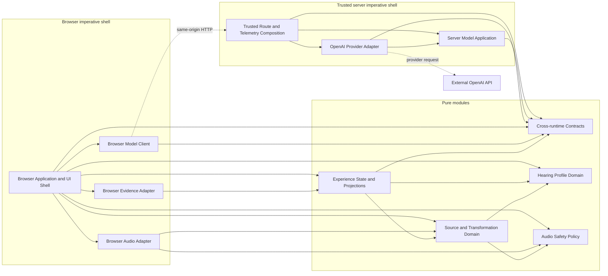

# Auralis Minimal Dependency Model

**Status:** Approved and complete Phase 6 dependency model  
**Date:** July 15, 2026  
**Scope:** Manual-Audiogram Critical-Chain Family Slice with Profile Choice  
**Evidence state:** Dependency design only; no source tree, installation, implementation, test or validation experiment has occurred

## 1. Purpose and scope

This document defines the smallest logical dependency model required to implement the approved vertical slice and Phase 5 system design.

It defines:

- logical responsibility boundaries;
- allowed dependency directions;
- forbidden cross-boundary imports;
- side-effect ownership;
- validation and safety placement;
- the model and audio boundaries;
- the minimal direct-dependency allowlist;
- constraints for the Phase 7 present-time file tree.

A logical module is not automatically a directory, package, deployment unit or source file.

This document does not redefine product scope, system topology, accepted ADRs, implementation details or the Phase 7 file tree.

## 2. Fixed constraints inherited from Phase 5

The dependency model preserves:

- one TypeScript, React and Next.js App Router deployment;
- one browser runtime and one trusted Node.js server boundary;
- no second backend, database, account system, queue or persistent session store;
- browser ownership of raw profile values and canonical `ExperienceState`;
- browser-only deterministic transformation and Web Audio processing;
- server-only OpenAI credentials and provider calls;
- no raw audiogram values in network requests, logs or exports;
- one validated multi-stem source package for every comparison state;
- structurally enforced same-source identity;
- one immutable digital audio-safety policy;
- visible proof derived from canonical state and validated results;
- explicit run, purpose, attempt and grounding-revision freshness checks;
- honest `live` and `degraded` states;
- optional image generation outside the mandatory audio path;
- separation of local product evidence from operational telemetry;
- no persistence or hidden retry.

## 3. Selected dependency principle

The selected principle is:

**Functional core with an explicit imperative shell.**

Rules:

1. Pure domain modules contain deterministic rules and no environment-specific side effects.
2. Browser and server adapters depend inward on pure contracts and policies.
3. Pure modules never depend on adapters or composition roots.
4. Composition roots instantiate and connect dependencies but contain no domain rules.
5. Static import direction and runtime invocation direction are distinguished where dependency inversion is used.
6. No service locator, global mutable dependency or hidden singleton is permitted.
7. No generic `utils`, `helpers`, `common` or `services` dumping ground is permitted.
8. Undocumented cross-boundary imports are forbidden.
9. The static import graph must remain acyclic.

## 4. Logical module catalog

### Cross-runtime Contracts

- **Runtime:** Cross-runtime; pure contract.
- **Responsibility:** Own bounded transport schemas, stable enums, error codes, `GroundingSnapshot`, model request and response contracts.
- **May depend on:** Zod only.
- **Must not depend on:** Browser or server implementations, React, Next.js, Web Audio, OpenAI SDK, environment access, storage or telemetry.
- **Allowed side effects:** None.
- **Validation or safety responsibility:** Runtime parsing of untrusted transport values and rejection of unknown or unbounded fields.
- **Boundary rule:** Raw `HearingProfile` threshold arrays are not part of any server transport contract.

### Hearing Profile Domain

- **Runtime:** Browser-owned, environment-independent pure TypeScript.
- **Responsibility:** Own predefined fixtures, manual drafts, normalization, left/right values, bounds, confirmation and no-preset-substitution behavior.
- **May depend on:** Zod for pure validation; no internal module is required.
- **Must not depend on:** UI, canonical experience state, transformation, Web Audio, network, server or model modules.
- **Allowed side effects:** None.
- **Validation or safety responsibility:** Profile shape, finite values, supported bounds, fixture integrity and explicit confirmation eligibility.
- **Boundary rule:** Raw values remain browser-only and are never redefined as derived grounding.

### Experience State and Projections

- **Runtime:** Browser-owned, environment-independent pure TypeScript.
- **Responsibility:** Own canonical `ExperienceState`, events, reducer transitions, grounding revisions, terminal state, visible-proof projection and ordered evidence values.
- **May depend on:** Cross-runtime Contracts, Hearing Profile Domain, Source and Transformation Domain.
- **Must not depend on:** React, Next.js, browser adapters, Web Audio, OpenAI SDK, environment access, telemetry or storage.
- **Allowed side effects:** None.
- **Validation or safety responsibility:** Stale-result rejection, live/degraded application, completion eligibility and deterministic evidence sanitization.
- **Boundary rule:** Visible proof and evidence are projections, never competing mutable sources of truth.

### Source and Transformation Domain

- **Runtime:** Browser-owned, environment-independent pure TypeScript.
- **Responsibility:** Own source-manifest rules, source identity, transformation planning, support semantics, TV intervention and `TransformationResult` identity.
- **May depend on:** Hearing Profile Domain and Audio Safety Policy.
- **Must not depend on:** Experience state, UI, Web Audio types, model modules, server code or telemetry.
- **Allowed side effects:** None; fetched bytes, decoded buffers and computed digests are supplied explicitly.
- **Validation or safety responsibility:** Manifest relationships, same-source invariants, plan validity, ear-specific semantics and intervention correctness.
- **Boundary rule:** Deterministic transformation never depends on GPT or provider output.

### Audio Safety Policy

- **Runtime:** Browser-owned, environment-independent pure TypeScript.
- **Responsibility:** Own canonical digital safety rules for plans, rendered output, transitions, stop/mute and fail-closed behavior.
- **May depend on:** No internal module.
- **Must not depend on:** Web Audio, UI, model modules, environment access, storage or telemetry.
- **Allowed side effects:** None.
- **Validation or safety responsibility:** Define pre-render, post-render and playback-transition acceptance results.
- **Boundary rule:** Adapters enforce this policy but cannot redefine or bypass it.

### Browser Application and UI Shell

- **Runtime:** Browser; composition root and presentation shell.
- **Responsibility:** Compose browser modules, handle user actions, dispatch canonical events and render approved projections.
- **May depend on:** All pure browser modules and the three browser adapters.
- **Must not depend on:** Trusted server implementations, OpenAI SDK, environment secrets or provider-specific types.
- **Allowed side effects:** DOM interaction and React rendering.
- **Validation or safety responsibility:** Capture explicit profile confirmation, low-volume acknowledgement and user playback gesture.
- **Boundary rule:** Components do not implement profile normalization, transformation coefficients, safety rules, Web Audio graphs or model orchestration.

The browser composition root may wire the Audio Safety Policy into the audio adapter. Presentational React components must not directly import, interpret or override the safety policy.

### Browser Audio Adapter

- **Runtime:** Browser; side-effect adapter.
- **Responsibility:** Fetch and decode the source package, verify byte identity, render plans, collect metrics and control audible playback.
- **May depend on:** Source and Transformation Domain and Audio Safety Policy.
- **Must not depend on:** Experience state, UI components, model modules, server code, secrets or telemetry.
- **Allowed side effects:** Asset fetch, digest calculation, audio decoding, Web Audio graph mutation, offline rendering, playback and browser audio-lifecycle observation.
- **Validation or safety responsibility:** Digest verification, post-render finite/peak/duration checks, transition enforcement and immediate stop/mute.
- **Boundary rule:** This is the only module allowed to import Web Audio APIs directly.

### Browser Model Client

- **Runtime:** Browser; side-effect adapter.
- **Responsibility:** Call bounded same-origin model contracts, observe timeout and cancellation, validate responses and return typed results to the browser shell.
- **May depend on:** Cross-runtime Contracts.
- **Must not depend on:** Raw Hearing Profile data, trusted server implementations, OpenAI SDK, Node APIs or environment secrets.
- **Allowed side effects:** Same-origin network requests, model-request timers and cancellation.
- **Validation or safety responsibility:** Client-side transport validation and rejection of payloads containing disallowed fields.
- **Boundary rule:** It returns typed results; only Experience State and Projections may apply them to semantic state.

### Browser Evidence Adapter

- **Runtime:** Browser; side-effect adapter.
- **Responsibility:** Present the session inspector and perform explicit user-triggered export of an already sanitized evidence projection.
- **May depend on:** Experience State and Projections.
- **Must not depend on:** Raw profile data, server telemetry, model providers, Web Audio internals or environment secrets.
- **Allowed side effects:** Browser-local file creation and download.
- **Validation or safety responsibility:** Final export allowlist check before download.
- **Boundary rule:** Evidence cannot drive product flow or change degraded state to live.

### Server Model Application

- **Runtime:** Trusted server; application/orchestration.
- **Responsibility:** Select bounded operations, validate grounding, coordinate provider ports and create typed live or degraded application results.
- **May depend on:** Cross-runtime Contracts.
- **Must not depend on:** React client code, browser state implementation, Web Audio, provider SDK types, environment access or logging adapters.
- **Allowed side effects:** No direct environmental side effects; it may invoke an injected provider port.
- **Validation or safety responsibility:** Operation allowlist, structured-output schema, semantic grounding, claims, output bounds and live/degraded classification.
- **Boundary rule:** It defines provider port contracts but does not import their implementation.

### OpenAI Provider Adapter

- **Runtime:** Trusted server; side-effect adapter.
- **Responsibility:** Implement text and optional-image provider ports using the official OpenAI SDK and normalize provider responses.
- **May depend on:** Cross-runtime Contracts and provider-port types owned by Server Model Application.
- **Must not depend on:** Browser modules, product state, transformation logic, evidence state or telemetry payload construction.
- **Allowed side effects:** Environment-secret access and external OpenAI text or image network calls.
- **Validation or safety responsibility:** Provider error, refusal, incomplete output and malformed provider-response normalization.
- **Boundary rule:** This is the only module allowed to import and invoke the official OpenAI SDK.

### Trusted Route and Telemetry Composition

- **Runtime:** Trusted server; composition root and side-effect boundary.
- **Responsibility:** Own HTTP Route Handler boundaries, body and same-origin controls, dependency wiring and allowlisted operational telemetry.
- **May depend on:** Cross-runtime Contracts, Server Model Application and OpenAI Provider Adapter.
- **Must not depend on:** Browser UI, raw browser `ExperienceState`, Hearing Profile Domain, Web Audio or browser evidence export.
- **Allowed side effects:** HTTP response handling and structured operational logging.
- **Validation or safety responsibility:** Final request-body validation, raw-profile rejection, telemetry allowlist and non-cacheable stateless behavior.
- **Boundary rule:** Route handlers compose dependencies but contain no model, product or transformation rules.

## 5. Allowed dependency-direction diagram

Solid arrows represent permitted static imports. Dotted arrows represent runtime calls, not source imports.



The documented dependency graph contains 12 modules and 23 proposed static import edges. An in-memory cycle check over this documented graph passed.

## 6. Key allowed dependencies

| Consumer | Allowed providers | Purpose |
|---|---|---|
| Experience State and Projections | Contracts, Profile, Transformation | Apply validated facts to one canonical state |
| Source and Transformation Domain | Profile, Safety Policy | Derive and validate deterministic plans |
| Browser Audio Adapter | Transformation, Safety Policy | Execute an approved plan and enforce safety |
| Browser Model Client | Contracts | Send and receive bounded transport values |
| Browser Evidence Adapter | Experience State and Projections | Export a read-only sanitized projection |
| Browser Application and UI Shell | Pure browser modules and browser adapters | Compose and present the browser flow |
| Server Model Application | Contracts | Validate bounded operations and results |
| OpenAI Provider Adapter | Contracts and Server Model Application port types | Implement provider ports without reversing ownership |
| Trusted Route and Telemetry Composition | Contracts, Server Model Application, OpenAI Adapter | Compose the trusted boundary |
| Browser Model Client | Trusted routes by HTTP only | No source import across the runtime boundary |

The Server Model Application may invoke an injected provider port at runtime, but it does not statically import OpenAI Provider Adapter.

## 7. Explicit forbidden imports

The following are forbidden:

1. Pure modules importing React, Next.js, Web Audio, OpenAI SDK, environment variables, telemetry, storage or browser globals.
2. Browser modules importing trusted route implementations, server-only modules, Node-only APIs or environment secrets.
3. Trusted server modules importing browser UI, browser adapters, raw browser `ExperienceState` or Web Audio.
4. UI components implementing profile normalization, transformation, safety thresholds, model calls or audio graphs.
5. Any transport contract containing raw left/right audiogram arrays.
6. OpenAI Provider Adapter owning product state, transformation rules, live/degraded classification or telemetry content.
7. Browser Audio Adapter calling models, using secrets or mutating the confirmed profile.
8. Evidence modules becoming a second semantic source of truth or controlling completion.
9. Optional image behavior becoming an upstream dependency of profile, transformation, safety, audio playback or completion.
10. A composition root being imported by a downstream module.
11. Any cyclic dependency.
12. Any undocumented cross-boundary import.

## 8. Side-effect ownership

| Material side effect | Single owner |
|---|---|
| Same-origin model request, timeout and cancellation | Browser Model Client |
| OpenAI text-model network call | OpenAI Provider Adapter |
| Optional image-model network call | OpenAI Provider Adapter, through a distinct optional port |
| Asset fetch, digest verification and audio decoding | Browser Audio Adapter |
| Web Audio rendering, transitions and playback | Browser Audio Adapter |
| Browser audio lifecycle observation | Browser Audio Adapter |
| DOM interaction and React rendering | Browser Application and UI Shell |
| Operational telemetry emission | Trusted Route and Telemetry Composition |
| Local evidence download | Browser Evidence Adapter |
| OpenAI environment-secret access | OpenAI Provider Adapter |

Pure modules remain side-effect free.

Audio scheduling belongs to Browser Audio Adapter. General request timeout and cancellation belong to Browser Model Client.

## 9. Validation and safety placement

| Validation or safety gate | Policy or earliest owner | Final blocking owner |
|---|---|---|
| Profile shape and audiogram values | Hearing Profile Domain | Hearing Profile Domain |
| Explicit profile confirmation | Browser UI Shell | Experience State reducer |
| Transport request and response | Cross-runtime Contracts | Model Client or Trusted Route |
| Raw-profile network prohibition | Cross-runtime Contracts | Trusted Route and Telemetry Composition |
| Source manifest relationships | Source and Transformation Domain | Source and Transformation Domain |
| Fetched source bytes and digests | Source and Transformation contract | Browser Audio Adapter |
| Transformation-plan validity | Source and Transformation Domain | Source and Transformation Domain |
| Pre-render digital safety | Audio Safety Policy | Browser Audio Adapter |
| Post-render finite, peak and duration safety | Audio Safety Policy | Browser Audio Adapter |
| Playback-transition and stop/mute safety | Audio Safety Policy | Browser Audio Adapter |
| Provider response normalization | OpenAI Provider Adapter | Server Model Application |
| Model schema and grounding | Server Model Application | Server Model Application |
| Stale run, purpose, attempt or grounding | Experience State and Projections | Experience State reducer |
| Live/degraded classification | Server Model Application | Experience State reducer |
| Evidence sanitization | Experience State projection | Browser Evidence Adapter |
| Terminal completion eligibility | Experience State and Projections | Experience State reducer |

Remote or earlier validation never removes the obligation of the final trust or safety boundary to reject invalid input.

## 10. Model-call boundary

The only allowed model-call sequence is:

```text
Browser Model Client
→ same-origin Trusted Route
→ Server Model Application
→ injected provider port
→ OpenAI Provider Adapter
→ external OpenAI API
```

The return path is:

1. OpenAI Provider Adapter normalizes provider output.
2. Server Model Application validates structure, grounding, claims and bounds.
3. Trusted Route validates the response transport.
4. Browser Model Client validates the received contract.
5. Experience State rejects stale run, purpose, attempt or grounding.
6. Only the reducer may apply a `live` or `degraded` semantic state.

Raw profile arrays, arbitrary prompt text and provider-specific browser payloads are prohibited.

The optional image operation uses a distinct provider port in the same OpenAI Provider Adapter. It cannot block deterministic transformation, playback, visible proof or completion.

## 11. Audio-processing boundary

The only allowed audio sequence is:

```text
confirmed Hearing Profile
→ Source and Transformation Domain
→ deterministic transformation plan
→ Audio Safety Policy pre-render result
→ Browser Audio Adapter
→ post-render safety result
→ validated TransformationResult
→ Experience State reducer
→ visible proof and evidence projections
```

Rules:

- GPT is absent from this path.
- Reference and comparison states reuse one decoded source package and source identity.
- Only Browser Audio Adapter may create or mutate Web Audio objects.
- Source and Transformation Domain operates only on serializable values.
- Unsafe or invalid output returns a typed failure and is never playable.
- Visible proof cannot inspect or reinterpret the internal audio graph.
- Stop/mute remains available independently of model and image operations.

## 12. Minimal external dependency allowlist

Exact versions are deliberately not selected in Phase 6. Versions, peer requirements and runtime compatibility must be reverified immediately before installation.

| Dependency | Decision | Permitted use |
|---|---|---|
| `next`, `react`, `react-dom` | Required; inherited from Phase 5 | Browser UI Shell and Trusted Route composition only |
| `typescript` | Required; inherited from Phase 5 | Strict type checking across all modules |
| `zod` | Selected runtime dependency | Contracts, profile validation and trusted validation owners |
| `openai` | Selected server runtime dependency | OpenAI Provider Adapter only |
| `vitest` | Selected dev-only dependency | Pure-core, reducer, contract and server-application tests |
| `@testing-library/react`, `@testing-library/dom` | Conditionally selected dev-only pair | React component behavior if retained after Phase 8 |
| `@playwright/test` | Selected dev-only dependency | Browser journey, failure injection and public smoke |
| `dependency-cruiser` | Selected dev-only boundary tool | Import-direction, forbidden-package and cycle checks |

Dependency rationale:

- Zod avoids separate hand-written validators for the same bounded runtime contracts and works in browser and Node environments.
- The official OpenAI SDK is required only by the approved trusted provider boundary.
- Vitest provides one TypeScript-oriented runner for deterministic and contract tests.
- Testing Library is allowed only for component-level behavior and brings its documented `@testing-library/dom` peer.
- Playwright covers automation and branded Chrome, but its WebKit build does not satisfy actual Safari acceptance.
- `dependency-cruiser` is selected instead of adding separate cycle and architecture-lint tools.

No state-management library, DSP framework, DI container, client-fetching framework, persistence library, auth library, telemetry SaaS SDK, event bus, code generator or monorepo tool is approved.

No separate ESLint architecture dependency is selected. If ESLint is later required for general code quality, it must not duplicate the dependency-cruiser architecture rules without a concrete benefit.

The exact DOM test environment required by Testing Library remains `NEEDS VERIFICATION`. No additional DOM package is approved by this document.

## 13. Enforcement approach

Phase 6 creates no configuration. Later enforcement must use the smallest layered set:

1. **TypeScript strict mode**
   - Enforces type and contract consistency.
   - Does not enforce architectural direction by itself.

2. **Next.js server/client boundary**
   - Server-secret modules use the `server-only` marker.
   - Next.js must fail a client import of marked server code.
   - This does not enforce pure-domain layering.

3. **dependency-cruiser**
   - Enforces the allowed static import directions.
   - Rejects cycles and forbidden cross-runtime imports.
   - Rejects production imports of unapproved external packages.
   - Its configuration belongs to the executable skeleton phase, not Phase 6.

4. **Runtime Zod validation**
   - Enforces bounded network and untrusted data contracts.
   - Static dependency tools cannot prove runtime payload privacy.

5. **Focused tests**
   - Verify raw-profile transport prohibition, reducer freshness, safety rejection and optional-image isolation.
   - Test implementation belongs to later phases.

6. **Review rule**
   - New cross-boundary imports and generic utility modules require explicit justification.
   - Undocumented dependencies fail review even if a tool does not detect them.

Known limitation: static analysis cannot prove runtime behavior, actual provider output, browser audio safety or physical listening conditions.

## 14. Phase 7 handoff

Phase 7 may map these logical modules into the smallest present-time source tree.

It must:

- preserve the approved dependency directions;
- preserve the single Web Audio and OpenAI SDK boundaries;
- preserve browser-only raw profile ownership;
- preserve one canonical experience-state owner;
- preserve optional-image isolation;
- preserve distinct browser and server composition roots;
- avoid one-directory-per-module dogma;
- co-locate small modules when ownership remains explicit;
- avoid generic shared or service directories;
- create only files needed for the executable walking skeleton;
- defer package installation and enforcement configuration to their approved implementation phase.

Phase 7 must not change an Accepted ADR or begin implementation.

## 15. Phase status

This document is the approved and complete Phase 6 dependency model.

It defines logical modules, dependency directions, side-effect ownership, validation and safety placement, model and audio boundaries, the minimal external dependency allowlist and Phase 7 constraints.

It does not create a source tree, install packages, implement code or claim that any test or validation experiment has passed.

All Risk Map dispositions remain unchanged. All vertical-slice acceptance criteria remain `NOT EXECUTED`.

Phase 7 has not been started.
