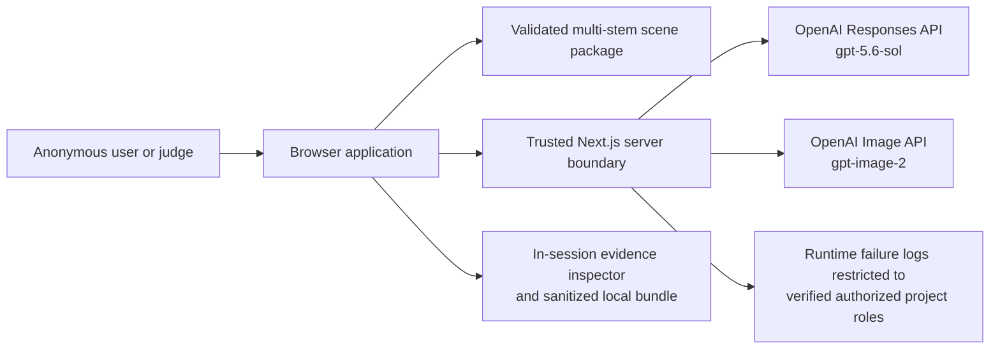
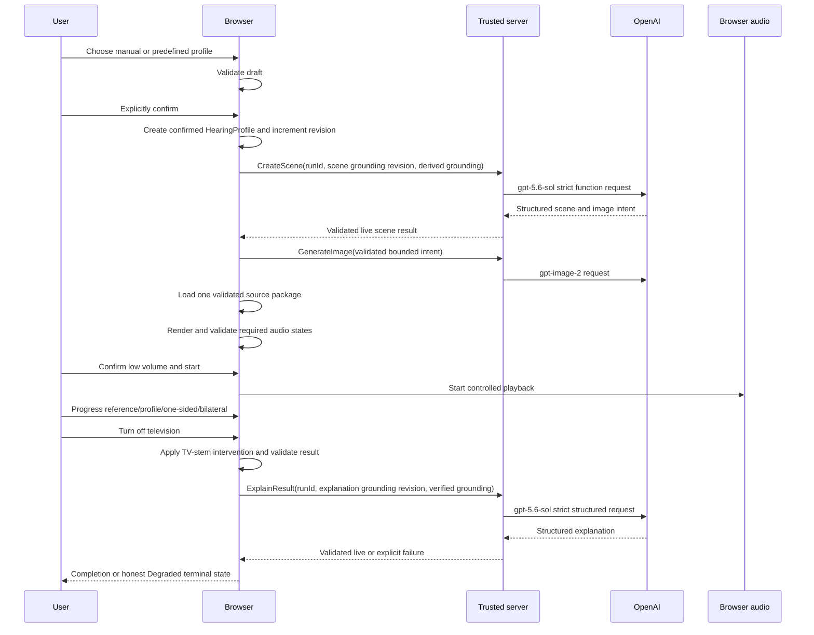

# Auralis Just-Enough System Design

**Status:** Approved, published and formally closed Phase 5 system design  
**Date:** July 15, 2026  
**Scope:** Manual-Audiogram Critical-Chain Family Slice with Profile Choice  
**Evidence state:** Design only; no implementation, deployment or validation experiment has been executed  
**First genuine proof deadline:** July 18, 2026, 02:00 CEST

## 1. Title and status

This document defines the smallest integrated system needed to reach the approved first genuine proof.

It is not a production architecture, future-product architecture, dependency model, source file tree, implementation plan or claim that any acceptance criterion has passed.

## 2. Purpose and scope

The design covers only:

- the four approved profile inputs;
- guided and confirmed manual audiogram entry;
- one validated family-dinner source package;
- deterministic same-source browser audio comparison;
- genuine one-sided and bilateral support states;
- the television-off intervention;
- data-derived visible proof;
- two bounded live GPT-5.6 operations;
- optional unique first-person image generation;
- honest degraded behavior;
- session-only raw profile data;
- digital playback controls;
- attributable evidence;
- one public judging deployment.

Everything not required by this slice is excluded.

## 3. Authority

Authority is applied in the order defined by `AGENTS.md`. The current operational sources are:

- `docs/PRODUCT_FREEZE_VALIDATION.md` for mandatory product scope;
- `docs/RISK_MAP.md` for risks, experiments, fallbacks and deadlines;
- `docs/VERTICAL_SLICE_DEFINITION.md` for the exact first flow and acceptance contract;
- P5-D01 through P5-D20 for explicit Phase 5 owner decisions.

Current technical facts were checked on July 15, 2026 against official OpenAI, Next.js, Vercel, Web Audio, Chrome, WebKit and Playwright sources.

No architectural decision in this document changes the immutable baseline snapshots.

## 4. Design drivers

| Driver | Required consequence |
|---|---|
| Manual-input truth | Confirmed manual values remain canonical and directly derive the transformation |
| Same-source A/B | All comparison states reuse the same decoded source buffers and source identity |
| Determinism | Equal source, profile, state and algorithm version produce equal render semantics |
| Ear-specific support | Left one-sided and bilateral states use different channel-specific plans |
| Safety | Playback is gesture-started, validated, bounded and immediately stoppable |
| Visible truth | Visible proof is derived from the same semantic state and render result as audio |
| Live GPT grounding | Model output references the current run, revision and verified result |
| Honest failure | Invalid, stale or timed-out model output cannot become `Live` |
| Session-only data | Raw profile values remain in browser memory and are not logged or persisted |
| Optional-media isolation | Image generation may fail without breaking the core |
| Evidence | Every state transition and result can be attributed to one run |
| Deadline | The system uses one application deployment and no prerequisite infrastructure |
| Judge access | The public experience requires neither an account nor a judge-supplied API key |
| Provenance | Every public asset has an identity and evidence record |
| Novice use | Guidance and change preview derive from the actual selected values |

## 5. Fixed vertical-slice constraints

The design preserves:

- exactly three synthetic predefined profiles and `Enter an audiogram`;
- the mandatory manual main proof;
- explicit confirmation before application;
- separate left/right values;
- no nearest-preset substitution;
- one reusable validated family-dinner audio source;
- exact same-source reference/profile/support comparison;
- actual TV-stem removal for television-off;
- deterministic audio independent from GPT;
- live structured scene intelligence and grounded explanation;
- explicit `Degraded` behavior;
- session-only raw values;
- data-derived visible state;
- attributable evidence;
- no accidental dead end;
- optional-media kill-test compatibility.

## 6. Selected system design

The selected design is a client-centric web application with one minimal trusted server boundary.

The browser owns:

- the canonical session state;
- draft and confirmed hearing profiles;
- deterministic transform planning and audio rendering;
- controlled playback;
- visible proof derivation;
- local evidence and sanitized export.

The trusted server owns:

- OpenAI credentials;
- strict request and response validation;
- two bounded GPT-5.6 text operations;
- the validated `gpt-image-2` call;
- data-minimized operational failure logging.

The deployment contains no database, account system, queue, persistent session store, media-processing service or second application backend.

Canonical decisions: ADR-0001 through ADR-0013.

## 7. Candidate architecture comparison

| Candidate | Result | Reason |
|---|---|---|
| Client-centric browser with minimal trusted server | Selected | Maximum slice coverage with minimum latency, transfer and operations |
| Server-centric transformation | Rejected | Adds media transfer, privacy exposure, latency and backend complexity |
| Streaming/distributed hybrid | Rejected | Adds realtime coordination and multiple failure surfaces without a slice requirement |

## 8. System context

The browser is untrusted from the server's perspective. `runId` and state revision are correlation data, not authentication.

## 9. Runtime and deployment topology

One Vercel project contains:

1. a React client rendered through Next.js App Router;
2. Node.js Route Handlers for trusted OpenAI and telemetry operations;
3. static validated source assets and their manifest.

The application is anonymous and publicly reachable. It has no login, user account, database or durable session.

The mandatory first-proof matrix is:

- current stable Google Chrome on a recorded macOS version;
- current stable Safari on the same macOS version;
- the same recorded wired stereo output chain.

Actual runtime and package versions must be recorded during Phase 9; output hardware must be recorded during Phase 10 product/runtime validation. No broader support claim follows from this design.

## 10. Logical responsibilities

| Responsibility | Runtime | Required output |
|---|---|---|
| Profile choice and novice guidance | Browser | Draft profile and truthful guidance |
| Profile validation and confirmation | Browser | Confirmed `HearingProfile` |
| Experience state reduction | Browser | Canonical `ExperienceState` |
| Source loading and identity | Browser | Validated decoded source package |
| Transform planning | Browser | Deterministic transformation plan |
| Audio rendering and metrics | Browser | Validated `TransformationResult` |
| Playback and safety | Browser | Controlled audible state |
| Visible proof derivation | Browser | State-consistent visible proof |
| Scene-intent request | Trusted server | Validated live `ModelResult` |
| Grounded explanation request | Trusted server | Validated live `ModelResult` |
| Unique scene-image generation | Trusted server | Optional current-run image or explicit unavailability |
| Local evidence | Browser | Inspector and sanitized bundle |
| Operational failure trace | Trusted server | Allowlisted event visible only to verified authorized project roles |

These are logical responsibilities, not Phase 6 module boundaries or import directions.

## 11. Trust boundaries

| Boundary | Allowed data | Prohibited data |
|---|---|---|
| Browser memory | Raw draft/confirmed profile, model result, rendered audio, evidence | Durable storage without a future owner decision |
| Browser → trusted server | Ephemeral run, request purpose/attempt, purpose-specific grounding revision, source reference and neutral derived grounding facts | Raw threshold arrays, credentials, arbitrary prompt text, personal context |
| Trusted server → OpenAI | Strict bounded request with derived grounding facts | API key in payload, raw audiogram, unrelated session history |
| Trusted server logs | Allowlisted failure code, step, duration bucket, ephemeral run ID | Raw profile, prompt, response, free text, image/audio payload, stable identity |
| Public repository/client | Public code and non-sensitive static assets | Secrets, real environment files, private URLs or sensitive evidence |

All network operations use HTTPS and server-side schema validation. Same-origin checks, bounded bodies, bounded outputs and spend/rate controls are required before public exposure.

## 12. End-to-end runtime flow

Image completion is not awaited by the deterministic audio path.

## 13. Profile-choice and input flow

The selector exposes exactly:

1. `High-frequency hearing loss`
2. `Flat hearing loss`
3. `Asymmetric hearing loss`
4. `Enter an audiogram`

Each choice creates a draft `HearingProfile`.

Predefined choices load exact frozen synthetic fixtures and disclose that they are synthetic and non-diagnostic.

Manual entry:

- begins with novice orientation;
- shows separate ears, frequencies and dB HL values;
- provides an actual-edit-derived preview;
- validates without diagnosis;
- requires explicit confirmation;
- creates a confirmed profile without mapping to a preset.

No transformation may use a draft profile.

## 14. Canonical session state

`ExperienceState` is the sole mutable semantic source of truth. It changes only through explicit events and a deterministic reducer.

| Field | Contract |
|---|---|
| `runId` | Random ephemeral identifier, rotated for a new run |
| `revision` | Monotonic semantic-state revision |
| `profileDraft` | Current editable profile or null |
| `confirmedProfile` | Confirmed `HearingProfile` or null |
| `scene` | Current `SceneState` |
| `comparisonState` | `reference` or `hearing-profile` |
| `supportState` | `none`, `left-one-sided` or `bilateral` |
| `interventionState` | Canonical `television-on` or `television-off` state |
| `playbackState` | `locked`, `ready`, `playing`, `muted`, `stopped`, `suspended`, `interrupted` or `failed` |
| `visibleProofState` | Computed read-only projection; never stored or independently mutated |
| `modelState` | Per-purpose `idle`, `pending`, `live` or `degraded` |
| `imageState` | Canonical `idle`, `pending`, `available` or `unavailable` state |
| `completionState` | `in-progress`, `complete-live` or `complete-degraded` |
| `evidence` | Ordered session-only evidence events |

Every asynchronous request carries its `runId`, request purpose, attempt identity and a purpose-specific grounding revision derived only from state fields relevant to that request. A result may be applied only while the run, purpose, attempt and every relevant grounding reference still match current pending state.

The global semantic revision remains audit evidence; it is not by itself an invalidation key for unrelated state changes. Scene requests are superseded by confirmed-profile or source-capability changes. Explanation requests are superseded by changes to profile, source, verified transformation, support or intervention grounding. Image results are superseded by changes to the run, accepted scene intent or image attempt, not by unrelated playback progress.

## 15. Audiogram and profile contract

### HearingProfile

| Field | Contract |
|---|---|
| `profileId` | Ephemeral profile reference |
| `sourceType` | `predefined` or `manual` |
| `presetId` | Exact predefined fixture ID or null |
| `frequencyGridHz` | Provisionally `[250, 500, 1000, 2000, 4000, 8000]` |
| `leftThresholdsDbHl` | One finite value per supported frequency |
| `rightThresholdsDbHl` | One finite value per supported frequency |
| `unit` | `dB HL` |
| `confirmationStatus` | `draft` or `confirmed` |
| `revision` | Incremented for every semantic edit |
| `disclosure` | Synthetic predefined or user-entered synthetic manual profile |
| `sessionLifetime` | Browser memory only |
| `validationState` | `valid`, `invalid` or `incomplete`, with neutral reasons |
| `profileFingerprint` | Ephemeral keyed correlation fingerprint; not a public value hash |

The provisional manual range is `0–100 dB HL` in 5 dB increments. It is an illustrative input boundary, not a clinical range or safe-listening recommendation.

The grid, range and exact three fixtures must be frozen before Phase 10 implementation begins. Changing them after seeing experiment results requires a recorded decision.

A transformation plan is derived from the confirmed normalized values. The plan is never the canonical profile, and manual input is never replaced with a preset.

## 16. Source identity and media contract

The validated source is a synchronized multi-stem package.

Its manifest records:

- stable scene-package ID and version;
- ordered stem IDs and semantic roles;
- at least focused speech, overlapping/background speech, television and kitchen/room contributions;
- per-stem cryptographic digest;
- common start, duration, channel layout and sample rate;
- base mixing parameters;
- provenance, applicable rights and modifications;
- manifest digest.

`sourceIdentity` is derived from the manifest version, ordered stem digests and frozen base mix.

Reference, hearing-profile, one-sided and bilateral states use the same decoded buffers and `sourceIdentity`.

Television-off preserves the base source identity while changing the explicit intervention state and setting the manifest-declared television contribution to zero.

### SceneState

| Field | Contract |
|---|---|
| `sourceSceneId` | Validated package ID |
| `sourceManifestHash` | Source identity evidence |
| `sceneIntent` | Current live structured intent or explicit prepared fallback state |
| `modelProvenance` | Current run, request purpose, model and response reference |
| `activeSourceIds` | Manifest-valid active stems |
| `interventionState` | Read-only projection of canonical `ExperienceState.interventionState` |
| `imageState` | Read-only projection of canonical `ExperienceState.imageState` |
| `imageProvenance` | `gpt-image-2` result reference when available |

The generated image is illustrative media. It must never redefine the audio source identity.

## 17. Deterministic transformation contract

The browser derives a versioned transformation plan from:

- confirmed profile;
- source manifest;
- comparison state;
- support state;
- intervention state;
- immutable safety policy.

The first implementation attempts standard Web Audio nodes through `OfflineAudioContext`. The renderer contract permits an AudioWorklet backend only if standard nodes fail a named transformation, evidence, timing or safety criterion.

The contract requires:

- ear-specific frequency-dependent processing;
- no nearest-preset substitution;
- no output whose only meaningful difference is overall gain;
- deterministic rendering within the recorded browser/runtime, sample rate, render backend and algorithm version; cross-browser comparison uses declared numerical tolerances rather than bitwise equality;
- source-buffer reuse across comparison states;
- objective level-normalized band-energy evidence;
- distinct left-one-sided and bilateral plans;
- real television-stem removal;
- finite and bounded output samples.

### TransformationResult

| Field | Contract |
|---|---|
| `runId` and `revision` | Owning semantic state |
| `profileRef` | Confirmed profile reference and fingerprint |
| `sourceIdentity` | Exact source manifest identity |
| `transformationId` | Deterministic identity over input references and state |
| `algorithmVersion` | Frozen renderer/transform version |
| `comparisonState` | Reference or hearing-profile |
| `supportState` | None, left-one-sided or bilateral |
| `interventionState` | Television on/off |
| `outputValidation` | Duration, channels, finite samples, peak and metric results |
| `safetyState` | `validated` or `rejected` |
| `objectiveEvidenceRef` | Session evidence event/reference |
| `renderedBufferRef` | Session-memory-only buffer reference |

Exact filter coefficients and objective pass thresholds are not chosen here. They must be declared before the corresponding Phase 10 experiment.

## 18. Support and intervention state contract

| State | Required processing |
|---|---|
| Reference | Base source with only the common safety envelope |
| Hearing profile | Ear-specific profile-derived transformation on both channels |
| Left one-sided support | Same profile/source with support applied only to the left-ear path |
| Bilateral support | Same profile/source with support applied independently to both ear paths |
| Television off | Same package and current profile/support state with only the television stem removed |

Support state cannot alter the confirmed profile, substitute the source or become a UI-only label.

Every state transition must produce a new `TransformationResult` or select a previously rendered result whose identity exactly matches current state.

## 19. Browser audio lifecycle and safety

One controlled playback `AudioContext` owns audible output.

Rules:

1. Offline rendering may occur before playback, but audible context start requires explicit user gesture.
2. Low-volume instruction must be acknowledged before start.
3. A rendered buffer is playable only after complete validation.
4. Any non-finite sample, channel/duration mismatch, render failure or ceiling overshoot rejects the buffer.
5. The provisional rendered sample-peak ceiling is `-6 dBFS`.
6. No transformed/support result may exceed the reference result's integrated level merely to improve apparent effectiveness.
7. State switches use a provisional 50 ms bounded fade-out/fade-in.
8. Stop or mute ramps to silence within at most 20 ms and terminates the source; validation before first user-facing Phase 10 audio must observe audible cessation within 100 ms.
9. Stop/mute has priority over rendering, state transitions and model requests.
10. A `suspended` or `interrupted` context immediately latches application mute and either terminates the active source or holds output at silence while updating semantic state.
11. A browser transition back to `running` does not clear the application mute latch; only a new explicit user action may unlock and restart or resume playback.
12. A rejected safety state blocks all user-facing playback.

The numerical values are provisional engineering limits for `EXP-P3-04`; they are not evidence of physical listening safety.

The product must continue to instruct low device volume and record the actual browser, OS and wired output chain. Physical output variability remains unresolved.

## 20. Shared semantic and visible-state contract

Visible proof is a pure derivation of:

- current confirmed profile;
- current `TransformationResult`;
- active source IDs;
- support and intervention states;
- playback status;
- model/image status.

It may visualize:

- separate left/right frequency effects;
- current comparison/support state;
- television source active or removed;
- transformation identity/version;
- live/degraded provenance;
- safety validation.

`visibleProofState` is computed from these canonical inputs when read. It cannot be dispatched or mutated as an independent semantic event.

A visual component may animate presentation, but it cannot maintain a competing semantic state. If audio and visible derivation disagree, the transition fails and playback stops.

## 21. Live GPT-5.6 contract

The trusted server uses:

- model `gpt-5.6-sol`;
- Responses API;
- `reasoning.effort: "xhigh"`;
- `store: false`;
- no conversation, `previous_response_id`, background job or server session;
- bounded input/output and explicit request purpose.

There are exactly two mandatory text operations.

### Create scene state

After profile confirmation, GPT-5.6 receives:

- ephemeral run, scene attempt and scene grounding revision;
- validated source-manifest capabilities;
- neutral profile-derived transformation facts without raw threshold arrays;
- non-clinical constraints;
- allowed active-source and intervention enums.

It must emit one strict `generate_scene_image` function call whose arguments contain:

- bounded unique first-person scene intent;
- structured scene state;
- only manifest-valid source references;
- a bounded image instruction.

The request forces the named function through explicit `tool_choice`, sets `parallel_tool_calls: false`, and the server rejects zero or multiple calls. Strict mode validates arguments against the schema; it does not replace the explicit call-count check. The server validates the complete tool call before accepting the scene result.

### Explain verified result

After television-off processing is verified, GPT-5.6 receives:

- current run, explanation attempt and explanation grounding revision;
- profile reference and neutral derived change facts;
- source identity;
- transformation identity/version;
- support and intervention states;
- verified objective result facts;
- required limitations.

It returns a strict structured explanation containing:

- concise result summary;
- what changed;
- what the result does not claim;
- one non-prescriptive action;
- exact grounding references.

### ModelResult

| Field | Contract |
|---|---|
| `runId`, `groundingRevision` | Owning run and purpose-specific grounding state |
| `observedGlobalRevision` | Audit correlation only; never a standalone validity condition |
| `requestPurpose` | `scene` or `explanation` |
| `attempt` | Explicit attempt number |
| `modelId` | Exact runtime model |
| `responseRef` | Provider response reference when one exists; otherwise null; session only |
| `structuredOutput` | Validated current output for `live`; null for `degraded` |
| `schemaValidation` | `pass`, `fail` or `not-run`, plus schema version |
| `semanticValidation` | `pass`, `fail` or `not-run`, plus bounded reason |
| `groundingRefs` | Current profile/source/transformation/support/intervention references |
| `latencyMs` | Observed request latency |
| `status` | `live` or `degraded` |
| `failureReason` | Null for `live`; required allowlisted reason for `degraded` |

No secret is included in this contract.

`ModelResult` is discriminated by `status`:

- `live` requires a provider response reference, validated structured output, schema and semantic `pass`, and a null failure reason;
- `degraded` requires null structured output, permits a null provider response reference, records `fail` or `not-run` validation states as applicable, and requires a non-null allowlisted failure reason.

## 22. Structured-output and grounding validation

Server validation occurs in this order:

1. validate request schema and bounded size;
2. verify supported request purpose and source enums;
3. call the exact model;
4. reject provider error, refusal, incomplete response or missing required output;
5. validate strict JSON Schema or strict function arguments;
6. enforce `additionalProperties: false`;
7. validate run, purpose, attempt, purpose-specific grounding revision and all grounding references;
8. reject unsupported source IDs, diagnosis, prescription, exact-perception or device-performance claims;
9. bound text and image-instruction lengths;
10. return a typed success or typed failure.

The browser revalidates the network response and applies it only if its run, purpose, attempt, purpose-specific grounding revision and every relevant grounding reference remain current.

Schema success is not semantic truth. Grounding and claim checks remain separate, and Phase 10 human evidence and pre-demo validation remain required.

## 23. Degraded-state and retry behavior

Each mandatory text request has a provisional hard timeout of 15 seconds.

There is no hidden automatic retry.

A request is cancelled or discarded when:

- its run is replaced;
- its purpose-specific grounding revision no longer matches the current relevant grounding state;
- the user explicitly cancels;
- the timeout expires.

Timeout, provider failure, refusal, invalid schema, invalid grounding or stale result produces `Degraded`.

In `Degraded`:

- the status is explicit;
- deterministic comparison may continue only when real and safe;
- the validated source remains identified as prepared media;
- live explanation is unavailable;
- no previous response is substituted;
- retry is explicit;
- the failed run does not count as live success;
- the terminal state remains deliberate and reachable.

Retry creates a new attempt tied to the current purpose-specific grounding revision. It never silently downgrades the model, reasoning effort, schema or grounding contract.

The live explanation must additionally satisfy the existing p95 ≤10-second evidence gate before `Functional` status.

## 24. Data lifetime, privacy and secret handling

Raw manual profile values exist only in browser memory.

They are not stored in:

- `localStorage`;
- `sessionStorage`;
- IndexedDB;
- cookies;
- URL/query state;
- server sessions;
- application logs;
- telemetry;
- evidence exports;
- model prompts.

The browser derives a bounded neutral `GroundingSnapshot` that contains only facts needed for scene/explanation grounding. It contains references and derived transformation facts, not raw threshold arrays or diagnostic labels.

The OpenAI API key exists only as a sensitive server-side deployment variable. It is never prefixed or exposed for client use, committed, printed or included in evidence.

The judge supplies no key.

Provider-side processing and retention remain governed by current provider terms; the design limits exposure by never sending the raw profile. `store: false` does not establish Zero Data Retention and does not by itself eliminate standard abuse-monitoring retention or eligible prompt caching.

## 25. Asset provenance and optional-media isolation

The validated audio package cannot enter a public build until `EXP-P3-14` records:

- origin;
- author or generation tool;
- applicable terms/version;
- permission or license basis;
- modifications;
- required attribution;
- per-file digest;
- approved public-use decision.

Every normal run requests one new first-person image. Every displayed generated image must belong to the current run.

The jury-reachable image capability must retain one truthful capability status. Until its required validation passes, a genuine current-run result is labelled `Experimental` with its limitations. Before a genuine result exists, the surface is hidden or labelled `In preparation`. A failed request is `unavailable`, never `Functional`, and never blocks the deterministic core.

If image generation is disabled, times out, is moderated, returns invalid output or otherwise fails:

- no old, pooled or stale image is displayed;
- `imageState` becomes `unavailable`;
- the deterministic audio and visible proof continue;
- live text status remains separately truthful;
- the optional-media kill test remains executable.

The optional image ceiling is provisionally 120 seconds and never blocks completion.

## 26. Observability and attributable evidence

Every semantic transition creates an ordered session evidence event with:

- run ID;
- monotonic sequence;
- state revision;
- event type;
- request purpose or transformation identity;
- source/profile references;
- support/intervention/playback/model/safety status;
- relative timestamp and duration;
- terminal result.

Three human-facing evidence surfaces are required:

1. ordinary visible proof in the experience;
2. an explicit in-session evidence inspector;
3. a client-generated sanitized per-run evidence bundle.

The sanitized bundle may contain:

- run and event sequence;
- profile source type and opaque fingerprint;
- source identity;
- transformation version and state;
- objective metrics;
- support/intervention state;
- safety results;
- model identifier/status/latency;
- terminal result.

It excludes:

- raw threshold values;
- prompts and model prose;
- image/audio payloads;
- credentials;
- stable identity.

Exact manual demo values are proven through the current in-session UI/inspector and attributable capture. The exported bundle links the capture to the same run without publishing raw values.

No incompatible runs may be assembled as one integrated proof.

## 27. Testing architecture

Validation uses four separate planes.

| Plane | Purpose | Can use fakes? | Real evidence required? |
|---|---|---|---|
| Deterministic core | Reducer, profile validation, plan derivation, render identity and metrics | No external service needed | Rendered-buffer evidence later |
| Contract/component | GPT schema, semantic rejection, timeout, retry, visible-state and UI behavior | Yes | No |
| Automated browser | Journey, failure injection, production smoke, browser state | Yes for OpenAI | Branded Chrome automation; WebKit only proxy |
| Observed real integration | Actual browser audio, physical chain, live model/image, latency and listening | No | Actual stable Chrome and Safari |

Required test seams include:

- deterministic time and ID sources;
- profile fixtures;
- source manifests;
- transform renderer contract;
- model and image provider boundaries;
- timeout/cancellation control;
- operational telemetry sink;
- browser audio state injection where possible.

Playwright WebKit cannot satisfy actual Safari acceptance.

No test or experiment is executed by this design. Required Phase 9 shell/static checks and Phase 10 product/runtime tests or experiments remain unexecuted.

## 28. Deployment, judge access and rollback

The public experience is one Vercel production deployment.

Judge access:

- uses a public HTTPS URL;
- starts at a deliberate reachable experience route;
- requires no login, access token or judge API key;
- exposes no development-only prerequisite;
- presents a deliberate friendly state for any intentionally unfinished capability.

Trusted route handlers are non-cacheable and stateless.

Before public exposure, the deployment must verify:

- sensitive OpenAI environment configuration;
- request body/output limits;
- same-origin policy;
- provider budget/spend monitoring;
- available rate/firewall controls;
- 15-second text and 120-second optional image duration behavior;
- clean-browser access;
- no raw-value or secret logging.

Rollback is promotion/rollback to the previous known-good immutable deployment. There is no database migration or durable user state to reverse.

Rollback eligibility and environment behavior must be observed on the selected Vercel plan before acceptance.

## 29. Architecture-to-risk traceability

A design response is not a mitigation. Every risk below retains its Risk Map disposition.

| Risk set | Design response | Required evidence |
|---|---|---|
| `RISK-PROD-01`–`RISK-PROD-04` | Deliberate state machine, real profile flow, TV-stem intervention, explicit unfinished states | `EXP-P3-01`, `EXP-P3-09`, `EXP-P3-18` |
| `RISK-CLAIM-01`–`RISK-CLAIM-02` | Neutral contracts, no diagnosis/prescription/exactness claims, bounded model validation | `EXP-P3-03`, `EXP-P3-07` |
| `RISK-CRED-01`–`RISK-CRED-05` | Profile-derived deterministic plan, same source, channel-specific support, shared state, objective metrics | `EXP-P3-02`, `EXP-P3-06`, `EXP-P3-07`, `EXP-P3-08` |
| `RISK-SAFE-01` | Central fail-closed safety policy and immediate stop/mute | `EXP-P3-04` |
| `RISK-WEB-01`–`RISK-WEB-03` | Actual Chrome/Safari proof, explicit audio lifecycle, renderer escalation gate | `EXP-P3-04`, `EXP-P3-05`, `EXP-P3-08` |
| `RISK-PERF-01` | Desktop-only first-proof claim and bounded requests | `EXP-P3-05` |
| `RISK-UX-01`–`RISK-UX-02` | Novice orientation, deliberate states, non-audio visible evidence | `EXP-P3-03`, `EXP-P3-13`, `EXP-P3-16` |
| `RISK-AI-01`–`RISK-AI-03` | Exact live model contract, strict validation, no hidden retry, explicit degraded state | `EXP-P3-10`, `EXP-P3-11` |
| `RISK-DEMO-01`–`RISK-DEMO-03` | One integrated run, public anonymous route, same-source/evidence attribution | `EXP-P3-01`, `EXP-P3-08`, `EXP-P3-15`, `EXP-P3-16` |
| `RISK-SEC-01`–`RISK-SEC-02` | Browser-only raw data, server-only key, sanitized telemetry and bundle | `EXP-P3-07`, `EXP-P3-12`, `EXP-P3-15` |
| `RISK-COMP-01`–`RISK-COMP-03` | Truthful source/model/status records and no invented submission evidence | `EXP-P3-17` |
| `RISK-IP-01`–`RISK-IP-03` | Mandatory manifest provenance and no unaudited public asset | `EXP-P3-14` |
| `RISK-TIME-01`–`RISK-TIME-03` | One deployment, no persistence infrastructure, optional image off critical path | `EXP-P3-01`, `EXP-P3-18` |
| `RISK-SCENE-01` | One validated multi-stem package; generated image isolated | `EXP-P3-11`, `EXP-P3-16` |
| `RISK-DOC-01` | Canonical ADRs, status provenance and attributable evidence | `EXP-P3-03`, `EXP-P3-16`, `EXP-P3-17` |

All 37 Risk IDs are covered. None is marked `MITIGATED`.

## 30. Architecture-to-acceptance traceability

Every criterion remains `NOT EXECUTED`.

| VS-AC | Architecture coverage | Later evidence |
|---|---|---|
| `VS-AC-01`–`VS-AC-06` | Confirmed canonical profile, direct plan derivation, no preset substitution | `EXP-P3-01`, `EXP-P3-07` |
| `VS-AC-07`–`VS-AC-10` | Validated manifest, exact source identity, deterministic render and level-normalized metrics | `EXP-P3-01`, `EXP-P3-02`, `EXP-P3-08`, `EXP-P3-11`, `EXP-P3-14` |
| `VS-AC-11`–`VS-AC-12` | Distinct channel-specific one-sided and bilateral plans | `EXP-P3-08` |
| `VS-AC-13` | Visible proof derived from canonical state/result | `EXP-P3-06` |
| `VS-AC-14`–`VS-AC-16` | Gesture start, centralized safety, stop/mute | `EXP-P3-04` |
| `VS-AC-17`–`VS-AC-18` | Exact live model, structured scene, grounded explanation | `EXP-P3-03`, `EXP-P3-10` |
| `VS-AC-19` | Explicit TV-stem removal and shared intervention state | `EXP-P3-09` |
| `VS-AC-20`–`VS-AC-21` | Explicit degraded state, no response reuse or false-live label | `EXP-P3-10` |
| `VS-AC-22` | Browser-only raw profile and server-only credential | `EXP-P3-07`, `EXP-P3-12` |
| `VS-AC-23` | Deliberate event-driven path and terminal states | `EXP-P3-01`, `EXP-P3-15` |
| `VS-AC-24` | Generated image isolated and killable | `EXP-P3-11` |
| `VS-AC-25` | Completion state derived from actual completed states | `EXP-P3-01`, `EXP-P3-03` |
| `VS-AC-26` | Minimum one-deployment architecture | `EXP-P3-18` |
| `VS-AC-27` | Recorded actual Chrome and Safari environments | `EXP-P3-05` |
| `VS-AC-28` | Fresh-run and latency evidence, no false-live state | `EXP-P3-10` |
| `VS-AC-29` | Run-correlated inspector and sanitized bundle | `EXP-P3-01` |
| `VS-AC-30` | Exactly four profile choices feeding one flow | `EXP-P3-01`, `EXP-P3-07`, `EXP-P3-18` |
| `VS-AC-31` | Frozen preset fixtures using the same transformation path | `EXP-P3-01`, `EXP-P3-02`, `EXP-P3-07` |
| `VS-AC-32` | Required novice orientation before confirmation | `EXP-P3-03` |
| `VS-AC-33` | Local exact-edit preview plus grounded result explanation | `EXP-P3-03`, `EXP-P3-06`, `EXP-P3-07` |

All `VS-AC-01` through `VS-AC-33` are covered. None is passed.

## 31. ADR index

| ADR | Title | P5 decisions | Status |
|---|---|---|---|
| ADR-0001 | Client-centric single-deployment topology and supported environment | P5-D01, P5-D04, P5-D14 | Accepted |
| ADR-0002 | TypeScript, React and Next.js App Router execution environments | P5-D03 | Accepted |
| ADR-0003 | Anonymous ephemeral browser session with no persistence | P5-D02 | Accepted |
| ADR-0004 | Trusted OpenAI gateway and exact model contract | P5-D05 | Accepted |
| ADR-0005 | Canonical hearing-profile representation and confirmation | P5-D07 | Accepted |
| ADR-0006 | Deterministic same-source multi-stem rendering and support semantics | P5-D08, P5-D09, P5-D11 | Accepted |
| ADR-0007 | Browser audio lifecycle and fail-closed digital safety | P5-D12 | Accepted |
| ADR-0008 | Single semantic experience state and derived visible proof | P5-D06 | Accepted |
| ADR-0009 | Bounded two-stage GPT lifecycle with honest degraded behavior | P5-D10, P5-D18 | Accepted |
| ADR-0010 | Optional unique scene image through exact gpt-image-2 | P5-D15, P5-D17 | Accepted |
| ADR-0011 | Attributable in-session evidence and sanitized bundle | P5-D13, P5-D19 | Accepted |
| ADR-0012 | Data-minimized pseudonymous operational telemetry | P5-D16 | Accepted |
| ADR-0013 | Four-plane critical-chain testing | P5-D20 | Accepted |

## 32. Explicitly rejected complexity

The current design rejects:

- a database;
- accounts or authentication;
- server-side session storage;
- local/session browser persistence;
- a separate frontend and backend deployment;
- server-side audio rendering;
- audio uploads;
- streaming or realtime transport;
- queues, background workers or event buses;
- microservices;
- live ambient-audio generation;
- generated imagery in the critical path;
- mandatory AudioWorklet before evidence requires it;
- a generic plugin system;
- event sourcing;
- multi-tenant architecture;
- mobile parity claims;
- future-product capability abstractions;
- a separate API specification, data-model document or test-plan document.

## 33. Open questions and provisional decisions

The following are explicit and do not count as validated:

1. `[250, 500, 1000, 2000, 4000, 8000] Hz`, `0–100 dB HL`, 5 dB steps are provisional input constants.
2. The exact three predefined fixtures remain to be frozen before Phase 10 implementation begins.
3. Exact profile-to-transform coefficients and objective thresholds remain to be declared before experiment execution.
4. Standard Web Audio nodes are preferred, but AudioWorklet remains available behind the renderer contract.
5. The `-6 dBFS`, 50 ms, 20 ms and 100 ms safety limits are provisional until EXP-P3-04.
6. Real `gpt-5.6-sol` access, billing, `xhigh` latency and output quality are unverified.
7. GPT Image organization verification and actual `gpt-image-2` latency are unverified.
8. Actual stable Chrome/Safari behavior and codec support are unverified.
9. The final source package and all provenance remain unselected.
10. Vercel plan, rollback eligibility, rate controls and log retention remain unverified.
11. Exact dependency packages and versions belong to Phase 6.
12. Source directories and files belong to Phase 7.

These are not current Phase 5 blockers. Relevant failures become blockers at their recorded experiment/public-exposure gates.

## 34. Phase 6 handoff constraints

Phase 6 may define only the dependency model needed to realize these responsibilities.

It must preserve:

- browser ownership of raw profile, canonical state and deterministic audio;
- server ownership of secrets and OpenAI calls;
- one deployment;
- no persistence;
- source identity and render-result contracts;
- central safety policy;
- purpose-specific grounding-revision-gated asynchronous results;
- optional image isolation;
- separate local evidence and operational telemetry;
- four evidence planes.

Zod, the official OpenAI JavaScript SDK, Vitest, Testing Library and Playwright remain candidates until Phase 6 explicitly evaluates them.

Phase 6 must not create the Phase 7 file tree or begin implementation.

## 35. Decision ledger

| Decisions | Outcome |
|---|---|
| P5-D01–P5-D05 | Client-centric TypeScript/React/Next application, one Vercel deployment, exact server-side GPT-5.6 Sol boundary |
| P5-D06–P5-D10 | One semantic state, canonical normalized profile, deterministic offline rendering, multi-stem source, two live text calls |
| P5-D11–P5-D14 | Worklet escalation gate, central safety, local evidence, mandatory Chrome and Safari proof |
| P5-D15–P5-D17 | New first-person image requested per normal run, pseudonymous telemetry, exact gpt-image-2 server orchestration |
| P5-D18–P5-D20 | Fail-fast purpose-specific grounding-revision-gated requests, inspector/bundle, four-plane testing |

P5-D14 is the only owner selection that materially diverges from the Codex recommendation.

## 36. Change control

After acceptance, a material change to a canonical decision requires:

1. a new explicit owner decision;
2. a new ADR;
3. the previous ADR marked `Superseded`;
4. preserved original rationale;
5. updated system-design integration and traceability;
6. validation of the resulting risk and acceptance impact.

Later evidence may refine provisional numeric parameters without rewriting history, but it may not silently change topology, data boundaries, source truth, safety semantics or live/degraded meaning.

## 37. Phase status

Phase 5 is complete, validated, published and approved by the human owner.

This document records the owner-approved Phase 5 design. No architecture experiment, implementation, dependency selection, deployment or acceptance run has occurred.

All Risk Map dispositions remain unchanged. All vertical-slice acceptance criteria remain `NOT EXECUTED`.

Phase 6 has not been started.
